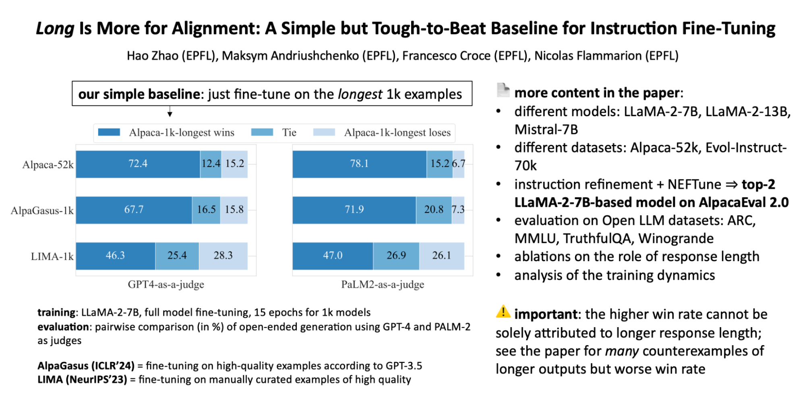

# Long Is More for Alignment: A Simple but Tough-to-Beat Baseline for Instruction Fine-Tuning

<a href="https://marcelluszhao.github.io/">Hao Zhao</a>, <a href="https://www.andriushchenko.me/">Maksym Andriushchenko</a>, <a href="https://scholar.google.com/citations?user=laq9cq0AAAAJ&hl=zh-CN">Francesco Croce</a>, <a href="https://people.epfl.ch/nicolas.flammarion">Nicolas Flammarion</a> (EPFL)

**Paper:** [https://arxiv.org/abs/2402.04833](https://arxiv.org/abs/2402.04833)
<p align="center"></p>

> TL;DR: We uncover the surprising effectiveness of fine-tuning only on the longest 1,000 instruction of large datasets to obtain aligned models.
> - With a lightweight refinement step, the quality of training instructions is notably improved, thus further enhancing the instruction-following capability of aligned models.
> - Through ablation studies and comprehensive evaluations, we demonstrate that the impressive performance of our method is not achieved by exploring length bias.

## :tada: News
- [Mar 08, 2024] The code and datasets for this project are released.
- [Mar 04, 2024] Our paper was accepted to the <a href="https://dmlr.ai/">ICLR 2024 Workshop on Data-centric Machine Learning Research</a>.

## :rocket: ToDo
- [X] Release the code
- [X] Release the data
- [ ] Release the instruction fine-tuned models

## Install
### Training
The training code is mostly dependent on the <a href="https://github.com/lm-sys/FastChat">FastChat</a> platform. So we install the required packages via running 
```bash
cd training
pip3 install --upgrade pip  # enable PEP 660 support
pip3 install -e ".[model_worker,webui]"
pip3 install -e ".[train]"
```
It may take a while to compile `flash-attn`. Alternatively, one can use <a href="https://github.com/facebookresearch/xformers">xformers</a>, which is also supported by FastChat. Xformers is seemed better because it supports more GPU architectures than flash-attention, including V100，while having similar memory footprint and flops compared to flash-attention. 

:bulb: If you come across an issue of incompatible packages like us when utilizing fine-tuning on full model weights, we provide a particular version of `transformers` (v4.34.1) in `training/transformers-4.34.1` that also supports NEFTune. To use it, please run
```bash
cd training/transformers-4.34.1
pip install -e .
```

### Evaluation
One can find standardized code for evaluation we did in our paper from:
- <a href="https://github.com/EleutherAI/lm-evaluation-harness">Open LLM Leaderboard</a>
- <a href="https://github.com/tatsu-lab/alpaca_eval">AlpacaEval 2.0</a>

MT-Bench is a part of the FastChat platform. To support evaluation on MT-Bench, one can run:
```bash
cd training
pip3 install -e ".[llm_judge]"
``` 

## Datasets
One can find instruction fine-tuning (IFT) datasets used to align base models under the `data` folder. In particular,
- `data/alpaca/filtered_alpaca_1k_longest.json` is the filtered 1,000 training examples from the Alpaca-52k dataset. The format of data has been adjusted in accordance to the requirement of FastChat. We verified that examples selected by the length heuristics are largely different from that of selected by using ChatGPT as the quality evaluator.
- `data/alpaca/refined_alpaca_1k_longest.json` is the refined version of `filtered_alpaca_1k_longest.json` after adopting our introspection-based refinement step. The format of data has been adjusted in accordance to the requirement of FastChat. A diverse set of open-ended evaluation results (e.g., pair-wise comparison, AlpacaEval 2.0, MT-Bench) show that instruction fine-tuning on `refined_alpaca_1k_longest.json` leads to a more powerful aligned model.
- `data/alpaca/filtered_alpaca_1k_score.json` is the 1,000 training examples from the Alpaca-52k dataset filtered by the ChatGPT quality evaluator as used in <a href="https://arxiv.org/abs/2307.08701">AlpaGasus</a>. The format of data has been adjusted in accordance to the requirement of FastChat. We used uniform sampling to help select examples with a score of 4.5.
- `data/evol-instruct/filtered_evol_instruct_1k_longest.json` (`data/evol-instruct/filtered_evol_instruct_1k_score.json`) is the 1,000 training examples from the Evol-Instruct-70k dataset filtered by the length heuristics (ChatGPT quality evaluator). The format of data has been adjusted in accordance to the requirement of FastChat.

## Experiments 

We provide some scripts for training the open-sourced LLMs used in the paper. Working with FastChat enables us to conduct experiments with only 4x 80GB A100s. 

This section contains commands for running training and inference on 7B and 13B models.

- To do instruction fine-tuning on Llama2-7B, run the following command inside `training`:
```bash
cd training
wandb login
bash scripts/train_llama2_7b.sh
```
- To do instruction fine-tuning on Llama2-13B, run the following command inside `training`:
```bash
cd training
wandb login
bash scripts/train_llama2_13b.sh
```
- To do instruction fine-tuning on <a href="https://huggingface.co/mistralai/Mistral-7B-v0.1">Mistral-7B</a>, run the following command inside `training`:
```bash
cd training
wandb login
bash scripts/train_mistral_7b.sh
```
- To generate new responses for questions from test datasets: Koala, LIMA, Self-Instruct, Vicuna, WizardLM, run the following command:
```bash
cd generation
python generate_test.py --model_name_or_path [MODEL-PATH] --test_path [DATA-PATH] --save_path [SAVE-PATH]
```
- Before doing an evaluation with LLMs-as-a-judge, one should prepare data following a particular format: a list of dictionaries, where each dictionary contains an instruction and two responses generated by different models. This is a simple example:
```json
[
      {
            "id": "XXX",
            "prompt": "XXX",
            "reference_model_name": "XXX",
            "target_model_name": "XXX",
      }
]
```
- To carry out pair-wise comparisons with GPT4-as-a-judge or PaLM2-as-a-judge, run the following commands:
```bash
cd evaluation
# GPT4-as-a-judge
bash run_llm_eval_gpt4.sh

# PaLM2-as-a-judge
bash run_llm_eval_palm2.sh
```

- To carry out MT-Bench evaluation, run the following commands(refer to the documentation in `training/fastchat/llm_judge` for more details):
```bash
# step 1: Generate model answers to MT-bench questions
python gen_model_answer.py --model-path [MODEL-PATH] --model-id [MODEL-ID]

# step 2: Generate GPT-4 judgments
export OPENAI_API_KEY=XXXXXX  # set the OpenAI API key
python gen_judgment.py --model-list [LIST-OF-MODEL-ID] --parallel [num-concurrent-api-call]

# step 3: Show MT-bench scores
python show_result.py --model-list [LIST-OF-MODEL-ID]
```

For more details about experimental setups, please refer to the Appendix A in our paper. Also, if you do not have enough computing resources, you could consider using deepspeed.

## Citation
If you find this useful in your research, please consider citing:
```
@misc{zhao2024long,
      title={Long Is More for Alignment: A Simple but Tough-to-Beat Baseline for Instruction Fine-Tuning}, 
      author={Hao Zhao and Maksym Andriushchenko and Francesco Croce and Nicolas Flammarion},
      year={2024},
      eprint={2402.04833},
      archivePrefix={arXiv},
      primaryClass={cs.CL}
}
```